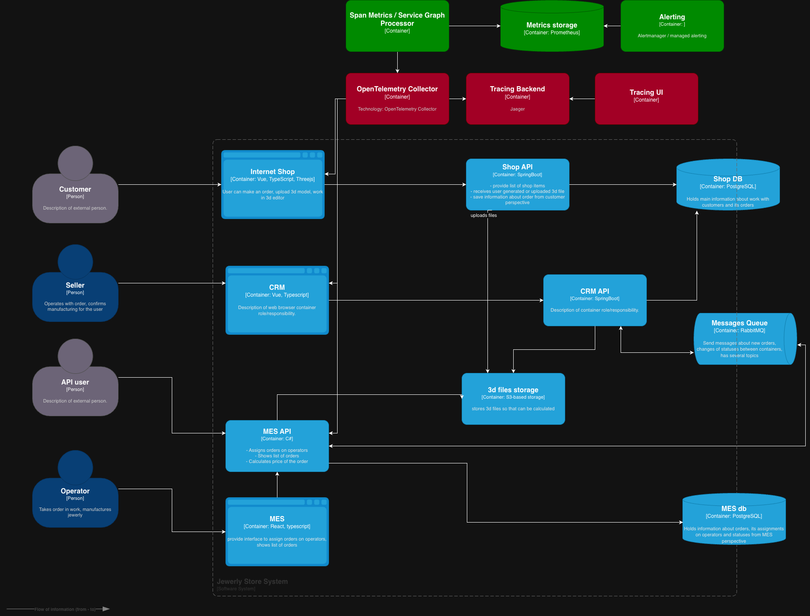
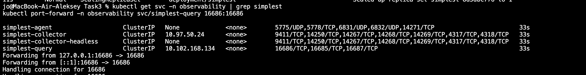
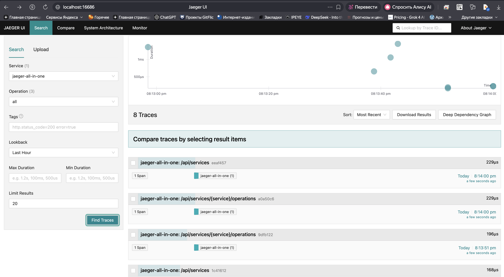

# Архитектурное решение по трейсингу

## 1. Контекст и проблематика

Команда сталкивается с ситуациями, когда заказ:
- “пропадает” между системами (Shop/CRM/MES),
- зависает на конкретном сервисе,
- не доходит из-за проблем в асинхронном обмене сообщениями (RabbitMQ),
- долго обрабатывается в MES (расчёт цены 2–30 минут) и непонятно, где тратится время: API, БД, S3, обработчик очереди.

Нужно внедрить **распределённый трейсинг** (distributed tracing), чтобы по `order_id` или `trace_id` можно было увидеть:
- где заказ сейчас,
- какие шаги прошёл,
- на каком шаге “сломался” или “застрял”,
- сколько времени заняли вызовы зависимостей (PostgreSQL, S3, RabbitMQ).

---

## 2. Какие системы покрыть трейсингом и где заказ может “сломаться”

### 2.1. Компоненты, которые обязательно покрываем трейсингом (MVP)

**Backend-сервисы (обязательно):**
1) **Shop API (Spring Boot)**  
   Риски: создание/обновление заказа, загрузка 3D-файла, запись в Shop DB, публикация/инициация событий (если есть).

2) **CRM API (Spring Boot)**  
   Риски: подтверждение производства, изменение статусов, интеграция с RabbitMQ, запись в БД.

3) **MES API (.NET / C#)**  
   Риски: расчёт цены (долгая операция), работа операторов (список заказов), запись в MES DB, чтение из S3, публикация/потребление событий.

**Интеграция (обязательно):**
4) **RabbitMQ (Messages Queue)**  
   Риски: потеря сообщений, redelivery, “ядовитые” сообщения, зависание консьюмеров, отставание обработки.

**Зависимости (обязательно как спаны зависимостей):**
5) **Shop DB (PostgreSQL)**
6) **MES DB (PostgreSQL)**
7) **S3-based storage (3d files storage)**

> Важно: DB/S3/RabbitMQ не “трейсятся” сами по себе как сервисы, но должны отражаться **спанами** внутри трейса сервисов.

### 2.2. Дополнительно (по возможности)
- **Frontend Internet Shop (Vue)** и **MES (React)** — RUM-трейсинг (не обязателен для MVP), чтобы цеплять “долго грузится” от браузера до API.
- **B2B API user** — мы не можем заставить партнёров слать `traceparent`, поэтому старт трассы будет на MES API, но мы будем добавлять `client_id`/API key как атрибут.

---

## 3. Какие данные должны попадать в трейсинг (структура и атрибуты)

### 3.1. Обязательные технические поля (для любого спана/трейса)
- `trace_id`, `span_id`, `parent_span_id`
- `service.name` (shop-api / crm-api / mes-api)
- `deployment.environment` (dev/release/prod)
- `host.name` / `instance_id` (если есть)
- `http.method`, `http.route`, `http.status_code` (для HTTP)
- `error` флаг + `exception.type`, `exception.message`, `exception.stacktrace` (для ошибок)
- `duration` (считается системой трейсинга)

### 3.2. Доменные атрибуты “про заказ” (ключ к диагностике)
- `order.id` — **обязательный** (если известен на момент спана)
- `order.status` и/или `order.status_from`, `order.status_to` (на шагах изменения статуса)
- `order.source` = `B2C|B2B`
- `user.id` (для CRM/Shop, если допустимо) и/или `client.id` (для B2B партнёров — **обязательно**)
- `file.id` / `file.key` (объект в S3), опционально `file.hash` (лучше hash, чем имя)
- `price_calc.job_id` (если есть асинхронная модель) или `price_calc.attempt`
- `db.statement` **не хранить полностью** (см. безопасность), лучше:
    - `db.operation` (SELECT/UPDATE/INSERT)
    - `db.table` (orders, order_status, …)
- `messaging.system=rabbitmq`
    - `messaging.destination` (queue/exchange)
    - `messaging.rabbitmq.routing_key`
    - `message.id` (**обязательный для диагностики дублей/потерь**)
    - `correlation.id` (если используется)

### 3.3. События внутри спана (span events)
- `order_status_changed` (from → to)
- `price_calculation_started` / `price_calculation_finished`
- `file_uploaded` / `file_downloaded`
- `message_published` / `message_consumed` / `message_acked`

---

## 4. Мотивация (зачем трейсинг и что он даст)

### 4.1. Бизнес-ценность
- Снижение числа “пропавших” заказов и просрочек за счёт быстрого поиска узкого места.
- Снижение потерь контрактов B2B: можно доказуемо отвечать, что произошло с заказом (таймлайн событий).
- Снижение нагрузки на поддержку и инженеров: вместо ручного “сверяем логи трёх систем” — один trace по `order.id`.

### 4.2. Технические и бизнес-метрики, которые улучшит трейсинг (3–5 штук)
1) **MTTR (mean time to recovery)** — время восстановления/разбора инцидента: станет меньше, потому что видно точку отказа.
2) **Доля инцидентов “unknown root cause”** — снизится (увидим, где рвётся цепочка).
3) **p95/p99 latency ключевых операций** (MES dashboard, расчёт цены, изменение статуса) — станет проще оптимизировать, т.к. видно вклад DB/S3/RabbitMQ.
4) **Lead time по заказу** (например, `SUBMITTED → PRICE_CALCULATED`) — станет измеримым и объяснимым (где задержка).
5) **Error budget / % 5xx** по сервисам — быстрее связывается с первопричиной (зависимости, консьюмеры, БД).

---

## 5. Предлагаемое решение

### 5.1. Технологии (концептуально)
- **OpenTelemetry (OTel)** как стандарт для трейсинга.
- **OpenTelemetry Collector** как единая точка приёма, фильтрации, семплинга и экспорта.
- Backend для трейсинга: **Jaeger** или **Grafana Tempo** (выбор может зависеть от того, что проще поднять в вашей инфраструктуре/облаке).
- UI: Jaeger UI или Grafana (если Tempo).

### 5.2. Как будет работать трассировка (сквозной сценарий)
**HTTP:**
1) Клиент (Shop UI / CRM UI / MES UI / B2B партнёр) вызывает API.
2) Сервис создаёт корневой span (или продолжает по `traceparent`).
3) Все вызовы зависимостей (DB/S3/RabbitMQ) становятся дочерними спанами.
4) Спаны отправляются в OTel Collector → в Tracing backend.

**RabbitMQ:**
- При публикации сообщения сервис:
    - создаёт span `publish` (PRODUCER),
    - кладёт в headers: `traceparent` + `message.id` + `correlation.id` (если есть).
- Консьюмер при получении:
    - извлекает `traceparent`,
    - создаёт span `consume` (CONSUMER),
    - продолжает тот же trace, чтобы цепочка была сквозной.

> Итог: один trace показывает путь заказа через Shop API → RabbitMQ → CRM API → RabbitMQ → MES API и т.д.

### 5.3. Семплинг (чтобы не было слишком дорого)
- На старте: **head-based sampling** (например, 5–10%) + правило “все ошибки 5xx — 100%”.
- По мере зрелости: **tail-based sampling** в OTel Collector:
    - сохранять 100% трейсов с `error=true`,
    - сохранять медленные (duration > N секунд),
    - сохранять трейсы конкретных `client.id` (если расследуем партнёра).

### 5.4. Что нужно доработать в сервисах (конкретные изменения)
1) Добавить генерацию и прокидывание `order.id` как атрибута в критических спанах:
    - создание заказа
    - изменение статуса
    - расчёт цены
    - назначение заказа оператору

2) Для RabbitMQ:
    - при публикации: класть `traceparent` в headers,
    - при потреблении: извлекать headers и продолжать trace,
    - логировать/трейсить `message.id`.

3) Принять правило: **не писать PII** в атрибуты и события (см. безопасность).

---

## 6. Изменения на C4-диаграмме

**Какие алёрты сделать “по заказу” на базе trace-derived метрик:**
- `SUBMITTED → PRICE_CALCULATED p95 > X минут`
- количество “ошибочных трейсов” (error=true) на критических маршрутах > порога
- рост времени `consume` спанов RabbitMQ (консьюмеры тормозят)
- spike по `client.id` (если добавим контролируемую кардинальность)

---

## 7. Компромиссы и ограничения

1) **Кардинальность атрибутов**  
   Если писать `user.id`/`order.id` без ограничений в метрики — можно “взорвать” стоимость хранения и нагрузку на backend.  
   Решение: `order.id` — только в трейсах (это нормально), а в метриках — агрегаты. `client.id` — ограниченно (топ-N + “other”).

2) **Семплинг**  
   При sampling < 100% не все заказы будут иметь trace.  
   Компромисс: для ошибок/медленных операций включить 100% (tail sampling правила).

3) **Трудности с end-to-end от браузера**  
   Если не внедрять RUM, начало trace будет на backend. Для MVP это ок: основные сбои “внутри” (MQ/DB/MES).

4) **Сложность трассировки асинхронных долгих операций**  
   Для 30-мин расчётов нужно корректно моделировать спаны (не держать один span 30 минут в одном запросе, если это async).  
   Компромисс: на первом этапе трассировать отдельные этапы (получение задачи → скачивание файла → расчёт → запись результата).

5) **Стоимость хранения трейсинга**  
   Трейсы тяжёлые по объёму, особенно при высоком RPS.  
   Решение: sampling + retention (например 7–14 дней “горячих” трейсов).

---

## 8. Безопасность

1) **Доступ к Tracing UI только сотрудникам**
- SSO/аутентификация (корпоративные учётки)
- RBAC роли (Support/DevOps/Engineering)
- запрет публичного доступа из интернета (VPN / private network)

2) **Шифрование**
- TLS/mTLS между сервисами и OTel Collector (по возможности)
- TLS к backend (Jaeger/Tempo)

3) **Минимизация чувствительных данных**
- не писать в атрибуты: ФИО, телефон, email, адрес доставки, полные payload’ы
- для диагностики использовать: `order.id`, `client.id`, технические коды ошибок

4) **Ретеншн и аудит**
- политика хранения трейсинга (например 14 дней)
- аудит доступа к UI

---

## 9. План внедрения (кратко)
1) Поднять OTel Collector + tracing backend (Jaeger/Tempo) в dev/release.
2) Подключить авто-инструментацию Shop API и CRM API (Java agent).
3) Подключить инструментирование MES API (.NET).
4) Внедрить propagation через RabbitMQ headers.
5) Ввести стандарт атрибутов (`order.id`, `message.id`, `client.id`, `status_from/to`).
6) Включить tail sampling для ошибок/медленных операций.
7) (Доп.) Spanmetrics → Prometheus → алёрты по SLA заказов.

Задание 3.1

